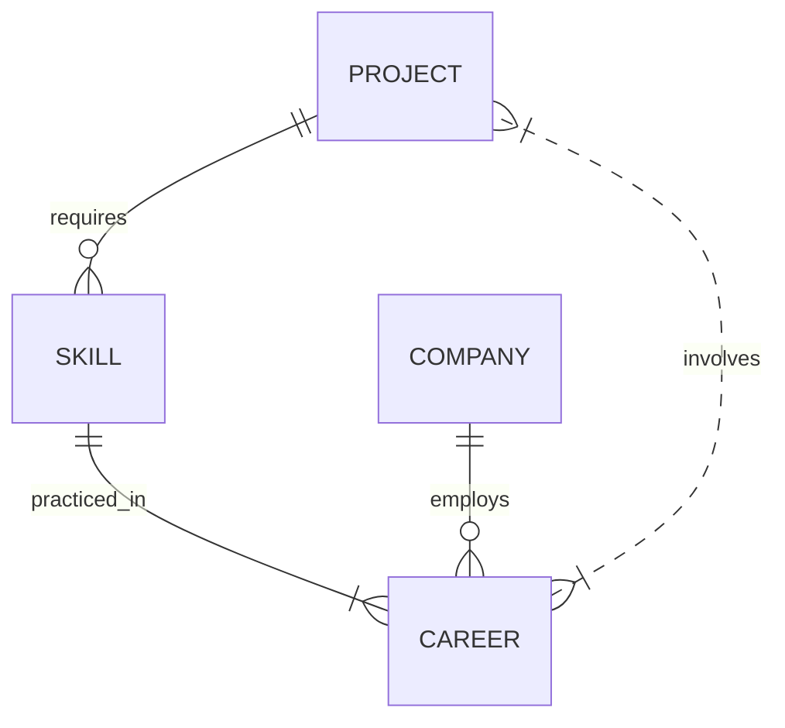
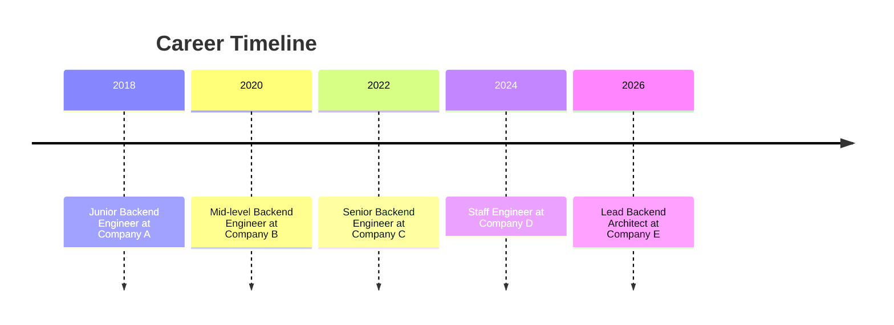

# Executive Summary

For a backend engineer’s portfolio, the site should emphasize **system architecture and data** rather than flashy UI. We propose a **Next.js (App Router) + TypeScript** application styled with **Tailwind CSS** in a dark theme by default. All data will be fetched through a strict TypeScript-typed “API” layer (mocked services) rather than hardcoding. The site will feel like a developer tool or monitoring dashboard (akin to Swagger UI or Grafana) – presenting projects, skills, career timeline, and system metrics in tables, cards, and logs. This approach aligns with recommendations that a strong backend portfolio highlights microservices, API design, data processing, and operational metrics【34†L17-L24】【28†L161-L169】, and focuses on *“system thinking”* over design flair. 

Key pages include a **Dashboard** (overview metrics and health checks), **Projects** (list and detail pages), **Skills**, **Career**, **API Docs**, and **System Status**. Each page will retrieve data from typed mock endpoints (e.g. `GET /api/projects`) to simulate a real backend. We will implement reusable React components with minimal state, using React Server Components or React Query for data fetching. Loading skeletons and React Error Boundaries will ensure smooth UX【8†L598-L602】【20†L676-L684】. The result is a site that showcases backend expertise – using server-driven content (data models, metrics, logs) to tell the story, rather than static marketing text【34†L17-L24】【22†L72-L80】.

## UI/UX and Visual Style

【48†embed_image】 *Figure: Example of a minimalist metrics-driven dashboard UI (TailPanel admin template).* 

The UI will mimic an internal tool or admin panel, not a glossy landing page. Dashboards should be **data-centric**: charts, tables, log streams, and code snippets, with consistent colors and typography. Observability best practices advise one page per key question (e.g. “Is the system healthy now?”) and progressive drill-down【22†L111-L119】. For instance, our Dashboard might show a summary card of project count and uptime, charts of CPU/memory, and error-rate graphs. Projects might be tabled like services with filters for tech and status. The example above illustrates how a Tailwind dashboard template arranges metrics and lists cleanly – this guides our design philosophy【22†L72-L80】.

Dark mode will be enabled by default. Tailwind supports theming via CSS variables【60†L189-L198】: for example, define primary colors in `:root` and override them in a `.dark` class. This way the site can toggle between light/dark by switching a class on `<html>`. We will centralize design tokens (colors, spacings) in `tailwind.config.js`【10†L69-L78】 and extract repeated utility patterns into small components to avoid “class soup”【10†L98-L107】. Accessibility basics (semantic tags, ARIA attributes) will be applied throughout.

## Data Model & Architecture

We treat each data entity as a TypeScript interface and simulate relationships. A possible ER-diagram is:



- **Project**: `{ id, name, description, techStack: string[], status, repoUrl, docsUrl }`.  
- **Skill**: `{ id, name, category, level, years, relatedProjectIds: number[] }`.  
- **CareerItem**: `{ id, company, role, startDate, endDate, responsibilities, technologies, achievements, projectIds: number[] }`.  
- **Company**: `{ id, name, industry, location }`.  

Projects require multiple skills; each career item (job) can involve projects and skills. These strict contracts reflect that **APIs are “contracts” between services**【28†L161-L169】. We will define clear REST-like endpoints (e.g. `GET /api/projects`, `POST /api/auth`) whose request/response schemas match these interfaces.

A **timing diagram** for the Career page could look like this:



This timeline flowchart will be presented on the **/career** page to highlight job progression graphically.

## Project Structure

We will use the Next.js App Router conventions【8†L598-L602】 and a modular folder layout:

| Path                    | Description |
|-------------------------|-------------|
| `app/`                  | Contains Next.js pages and layouts (see App Router conventions)【8†L598-L602】. For example, `app/layout.tsx` wraps all routes, and `app/loading.tsx` / `app/error.tsx` handle global loading and error UI. Dark-mode `<html className="dark">` can be toggled here. |
| `app/page.tsx`          | `/` (Dashboard) page – server component fetching overview data (metrics, project count, uptime). |
| `app/projects/`         | Folder for project-related routes: `page.tsx` (list), `[id]/page.tsx` (detail), plus `loading.tsx` and `error.tsx` for those routes. |
| `app/skills/`          | `/skills` page showing categorized skills cards. Uses a server component to fetch skill categories. |
| `app/career/`          | `/career` page with job timeline (with mermaid, or timeline component) and descriptions. |
| `app/api-docs/`        | `/api` mock documentation page (Swagger-like). Uses static props with example endpoint specs. |
| `app/system/`          | `/system` dashboard: simulated health checks, log stream, metrics graphs. |
| `public/`              | Static assets (images, favicon). |
| `services/api.ts`      | Service layer: functions like `fetchProjects()`, wrapping `fetch()` calls or using Axios. |
| `types/`               | TypeScript interfaces for all data models (Project, Skill, CareerItem, etc.). |
| `components/`          | Reusable UI components (cards, tables, charts, `ErrorBoundary`, `LoadingSkeleton`, etc.). |
| `features/` or `modules/` | Domain-specific logic (e.g. project features, authentication flows). |
| `styles/` or `tailwind.config.js` | Tailwind config with theme tokens (including dark mode variables【60†L189-L198】). |

Next.js encourages colocating a `loading.tsx` and `error.tsx` in each route folder, so every segment can show a skeleton UI or fallback error【8†L598-L602】【20†L676-L684】. We’ll leverage that: for example, `app/projects/error.tsx` catches failures fetching project data, and `app/projects/loading.tsx` shows spinners or gray boxes until data arrives.

## API Contract

We define a mock REST API with the following key endpoints:

| Endpoint                 | Method | Request (params/body)                        | Response (shape)                                 |
|--------------------------|--------|----------------------------------------------|--------------------------------------------------|
| `/api/profile`           | GET    | –                                            | `{ name, title, summary, contactInfo, metrics }` – engineer overview metrics (years exp, total projects, etc.) |
| `/api/projects`          | GET    | *(query)* `tech`, `status` to filter         | `{ projects: Project[] }` – list of project records |
| `/api/projects/:id`      | GET    | *(path)* `id`                                | `{ project: ProjectDetail }` – detailed info, including architecture and mock endpoints |
| `/api/skills`            | GET    | –                                            | `{ skillsByCategory: { [category: string]: Skill[] } }` – skills organized by category |
| `/api/career`            | GET    | –                                            | `{ jobs: CareerItem[] }` – chronological job entries |
| `/api/system/status`     | GET    | –                                            | `{ uptime, services: ServiceStatus[], metrics: SystemMetrics }` – simulated health data |
| `/api/system/logs`       | GET    | *(query)* `serviceId`, `limit`               | `{ logs: LogEntry[] }` – recent log lines (streamed via polling) |
| `/api/auth`              | POST   | `{ username, password }`                     | `{ token: string }` or error (we may skip actual auth) |
| `/api/projects/:id/endpoints` | GET | *(path)* `id`                         | `{ endpoints: ApiEndpoint[] }` – list of fake REST endpoints for this project |
| **Contracts:** All responses adhere to strict TypeScript interfaces. For instance, `ProjectDetail` includes `{ id, name, desc, techStack, repoUrl, docsUrl, status, architecture: ArchComponent[], endpoints: ApiEndpoint[], logs: string[] }`. These types ensure our front-end code knows exactly what each API returns – reflecting that **consistent API design reduces integration issues**【28†L161-L169】.

We’ll document these endpoints on the **/api** page, presenting them like Swagger: HTTP method, URL, description, and example request/response. For example, GET `/api/projects` might be shown with a sample JSON array of projects and their status codes.

## Key Components (Code Snippets)

We will build small, reusable React components (mostly function components) separating UI and data logic. Below are examples:

```tsx
// components/ProjectCard.tsx
export interface Project {
  id: number;
  name: string;
  description: string;
  techStack: string[];
  status: "active" | "archived";
  repoUrl?: string;
  docsUrl?: string;
}

export const ProjectCard: React.FC<{project: Project}> = ({ project }) => (
  <div className="p-4 bg-gray-800 rounded-lg shadow">
    <h3 className="text-xl font-semibold text-white">{project.name}</h3>
    <p className="mt-2 text-gray-300">{project.description}</p>
    <div className="mt-3 flex flex-wrap gap-2">
      {project.techStack.map((tech) => (
        <span key={tech} className="px-2 py-1 bg-indigo-600 text-sm text-white rounded">
          {tech}
        </span>
      ))}
    </div>
    <div className="mt-2 flex space-x-4">
      {project.repoUrl && (
        <a href={project.repoUrl} target="_blank" rel="noopener" className="text-blue-400 hover:underline">
          GitHub
        </a>
      )}
      {project.docsUrl && (
        <a href={project.docsUrl} target="_blank" rel="noopener" className="text-blue-400 hover:underline">
          Docs
        </a>
      )}
      <span className={`ml-auto px-2 py-1 text-xs rounded ${project.status === 'active' ? 'bg-green-500' : 'bg-gray-500'} text-white`}>
        {project.status}
      </span>
    </div>
  </div>
);
```

This `ProjectCard` uses Tailwind classes to form a dark card. By design, we centralized our color tokens (e.g. `bg-indigo-600`) via Tailwind config【10†L69-L78】, and extracted repeat patterns into components【10†L98-L107】. Similar cards/tables will be made for Skills, Career items, etc.

For data fetching, we might use **React Query**. For example, a projects list page:

```tsx
// pages/projects/index.tsx (Client Component)
'use client';
import { useQuery } from '@tanstack/react-query';

async function fetchProjects(): Promise<Project[]> {
  const res = await fetch('/api/projects');
  if (!res.ok) throw new Error('Failed to load projects');
  const data = await res.json();
  return data.projects;
}

export default function ProjectsPage() {
  const { data: projects, isLoading, error } = useQuery<Project[], Error>(
    ['projects'], fetchProjects
  );

  if (isLoading) return <div>Loading projects...</div>;
  if (error) return <div className="text-red-400">Error: {error.message}</div>;

  return (
    <div className="grid gap-4">
      {projects!.map((proj) => (
        <ProjectCard key={proj.id} project={proj} />
      ))}
    </div>
  );
}
```

React Query automates caching and refetching. We show a loading message or error if needed. (Alternatively, in Next.js App Router we could use a Server Component that `await fetch('/api/projects')`, but using React Query allows us to simulate client fetches and show loading states.) We wrap errors with an error boundary at higher level if unhandled【20†L676-L684】.

Other components: `LoadingSkeleton` (generic gray boxes), `ErrorBoundary` (catches render-time errors per route【20†L676-L684】), `DataTable` for tabular data, `CodeBlock` for displaying JSON or code, and so on. We avoid monolithic components: each UI piece is self-contained.

## Mock Service Implementation

We simulate a backend using a **mock API layer**. One approach is [Mock Service Worker (MSW)](https://mswjs.io), which lets us intercept `fetch` calls and return fake data. For example, handlers in `services/mocks.ts`:

```ts
// services/mocks.ts (using MSW)
import { rest } from 'msw';
import { Project, CareerItem, Skill } from '../types';

export const handlers = [
  // Projects list
  rest.get('/api/projects', (req, res, ctx) => {
    const tech = req.url.searchParams.get('tech');
    const filtered = MOCK_PROJECTS.filter(p => !tech || p.techStack.includes(tech));
    return res(
      ctx.status(200),
      ctx.delay(500), // simulate network latency
      ctx.json({ projects: filtered })
    );
  }),
  // Project detail
  rest.get('/api/projects/:id', (req, res, ctx) => {
    const { id } = req.params;
    const project = MOCK_PROJECTS.find(p => p.id === Number(id));
    if (!project) return res(ctx.status(404));
    // add fake architecture/endpoints
    const detail = { ...project, architecture: MOCK_ARCH, endpoints: MOCK_EP, logs: [] };
    return res(ctx.status(200), ctx.json({ project: detail }));
  }),
  // Skills by category
  rest.get('/api/skills', (req, res, ctx) => {
    return res(ctx.json({ skillsByCategory: MOCK_SKILLS }));
  }),
  // Career timeline
  rest.get('/api/career', (req, res, ctx) => {
    return res(ctx.json({ jobs: MOCK_JOBS }));
  }),
  // System status
  rest.get('/api/system/status', (req, res, ctx) => {
    return res(ctx.json({ uptime: '12 days', services: MOCK_SERVICES, metrics: MOCK_METRICS }));
  }),
  // Additional endpoints (logs, auth, etc.) as needed...
];
```

We’d integrate MSW in development (with `setupWorker(handlers)`) and even in testing. MSW is fully agnostic and works with any fetch or library like React Query【54†L272-L280】【54†L288-L296】. By inserting artificial delays (`ctx.delay`) and occasional error responses, we can test loading/error states realistically. This strategy creates a **single source of truth** for network behavior【54†L272-L280】【54†L288-L296】. Alternatively, a simpler approach is to host static JSON files or use Next.js API routes (`pages/api/...`) returning hardcoded data; but MSW is more flexible for simulating latency and errors.

## Example Pages

Below are sketches of three core pages using Next.js and Tailwind:

1. **Dashboard (`app/page.tsx`)** – a Server Component:

    ```tsx
    // app/page.tsx (Dashboard)
    import { DashboardLayout } from '../components/Layout';
    
    export default async function DashboardPage() {
      // In a Server Component we can await mock fetch calls
      const profileRes = await fetch('/api/profile');
      const profile = await profileRes.json();
      const statusRes = await fetch('/api/system/status');
      const system = await statusRes.json();
      return (
        <DashboardLayout>
          <h1 className="text-2xl font-bold">Engineer Dashboard</h1>
          <div className="mt-4 grid grid-cols-2 gap-6">
            <Card title="Total Projects" value={profile.metrics.projectCount} />
            <Card title="Years Experience" value={profile.metrics.yearsExperience} />
            <Card title="Uptime" value={system.uptime} />
            <Card title="Services Healthy" value={`${system.services.filter(s=>s.healthy).length}/${system.services.length}`} />
          </div>
          <section className="mt-8">
            <h2 className="text-xl font-semibold">Recent System Logs</h2>
            <LogStream logs={system.logs} />
          </section>
        </DashboardLayout>
      );
    }
    ```

    This page fetches aggregated data and shows key metrics using simple `Card` and `LogStream` components. Note the lack of decorative images; focus is on data. Any fetch failure would be caught by an `app/error.tsx` boundary as per Next.js【8†L598-L602】【20†L676-L684】.

2. **Projects List (`app/projects/page.tsx`)** – a Client Component with React Query:

    ```tsx
    'use client';
    import { useQuery } from '@tanstack/react-query';
    import { ProjectCard } from '../../components/ProjectCard';

    export default function ProjectsPage() {
      const { data: projects, isLoading, error } = useQuery(['projects'], fetchProjects);

      if (isLoading) return <LoadingSkeleton count={6} />;
      if (error) return <ErrorMessage error={error} />;

      return (
        <div>
          <h1 className="text-2xl font-bold">Projects</h1>
          <div className="mt-4 grid gap-4 md:grid-cols-2 lg:grid-cols-3">
            {projects!.map((proj) => (
              <ProjectCard key={proj.id} project={proj} />
            ))}
          </div>
        </div>
      );
    }
    ```

    Here we use `LoadingSkeleton` components during fetch (Next.js also supports a `loading.tsx`). Each `ProjectCard` shows name, tech tags, and status. Filters (tech, status) could be added via `<select>` or buttons that refetch.

3. **Project Detail (`app/projects/[id]/page.tsx`)** – Server Component:

    ```tsx
    export default async function ProjectDetailPage({ params }: { params: { id: string } }) {
      const res = await fetch(`/api/projects/${params.id}`);
      if (!res.ok) throw new Error('Project not found');
      const { project } = await res.json();
      return (
        <div>
          <h1 className="text-2xl font-bold">{project.name}</h1>
          <p className="mt-2 text-gray-300">{project.description}</p>
          <div className="mt-6 grid grid-cols-1 md:grid-cols-2 gap-4">
            <section>
              <h2 className="font-semibold">Architecture</h2>
              <ul className="list-disc list-inside">
                {project.architecture.map((svc) => (
                  <li key={svc.id}>{svc.name}: {svc.description}</li>
                ))}
              </ul>
            </section>
            <section>
              <h2 className="font-semibold">API Endpoints</h2>
              <ul className="list-disc list-inside text-xs font-mono">
                {project.endpoints.map((ep) => (
                  <li key={ep.path}><code>{ep.method} {ep.path}</code> – {ep.description}</li>
                ))}
              </ul>
            </section>
          </div>
          <section className="mt-6">
            <h2 className="font-semibold">Recent Logs</h2>
            <LogStream logs={project.logs} />
          </section>
        </div>
      );
    }
    ```

    This shows how even details page is data-rich: architecture list, endpoint list (like mini-API docs), and log stream. Any error (e.g. invalid ID) falls to `projects/error.tsx`.

These examples demonstrate the **server-driven UI**: all text comes from API data (faked), and the UI is sparse and technical. Throughout, we use Tailwind utility classes (with a consistent order【10†L132-L143】) to lay out content cleanly.

## Testing & Development Workflow

- **TypeScript & Linting:** We will configure strict TS (`tsconfig.json`) and ESLint/Prettier to enforce consistency. Tailwind’s class sorting plugin can automatically order classes【10†L132-L143】.
- **Component Testing:** Use Jest or Vitest with React Testing Library for unit tests. MSW can run in test mode to provide mock API responses, ensuring components behave correctly with mocked data. For example, a test might assert that `ProjectCard` renders all tech tags given a mock project.
- **Storybook (optional):** We can set up Storybook to document UI components (especially useful for the design-system approach【60†L253-L262】). 
- **Local Mocking:** During development, MSW runs in the browser to intercept real fetches. For production-like demonstration, we might also deploy static JSON (e.g. `public/data/*.json`) or use Next.js API routes as a backend stub.
- **CI/CD:** A GitHub Actions pipeline can run tests and lint on push. The final build (using `next build`) should emit minimal CSS via Purge (configured properly【60†L218-L226】) and pass all checks.

## Deployment

Since no real server-side logic is needed, we have choices:

- **Static Export:** Next.js supports full static export of pages (especially if we use `getStaticProps`/`app/export`)【57†L31-L39】. We could pre-render all pages into HTML+JSON and host on any static host (GitHub Pages, Netlify, AWS S3). This is simplest and fast, but dynamic client fetching from API routes would instead need real endpoints (so we'd likely embed mocks or JSON files).

- **Server Deployment:** Alternatively, deploy on Vercel or Netlify with a Node environment. We can use Next.js API routes to return mock data (similar to MSW but on server). Vercel easily serves Next.js with incremental static regen or full SSR. The [Deploying docs](https://nextjs.org/docs/app/getting-started/deploying) note that Next.js can run as Node or static site【57†L31-L39】. For ease, Vercel is recommended, which also provides preview URLs for each PR.

Either way, our mock data (MSW or JSON) must be accessible post-deploy. If using MSW, we’d include the service worker script. For static JSON, we’d pre-generate the data files during build.

## Checklist (MVP Prioritization)

1. **Define Data Models:** Write TS interfaces for Project, Skill, CareerItem, SystemStatus.  
2. **Setup Next.js+TS+Tailwind:** Create base app with `create-next-app`, install Tailwind, configure dark mode & tokens【60†L189-L198】.  
3. **Layout & Routing:** Add global `layout.tsx` (nav), and empty pages (`app/page.tsx`, `app/projects/page.tsx`, etc.) following Next conventions【8†L598-L602】.  
4. **Mock API Layer:** Implement MSW handlers (or JSON endpoints) with fake data and latency. Ensure `fetch()` works.  
5. **Dashboard & Cards:** Build Dashboard page with metric cards and health widget.  
6. **Projects Pages:** Build list and detail pages. Use `ProjectCard`, fetch list, and detail view with logs.  
7. **Skills & Career:** Implement `/skills` page (group by category) and `/career` page with timeline (use mermaid or custom component).  
8. **API Docs Page:** Create `/api` page showing endpoint table (Swagger-like).  
9. **System Page:** Build `/system` status page with fake service list, charts, and log stream.  
10. **UX Polish:** Add skeleton loaders (`loading.tsx`), error pages (`error.tsx`), and accessibility labels.  
11. **Testing:** Write a few tests (e.g. Projects list renders cards given MSW).  
12. **Deployment:** Configure build. Try static export, or deploy on Vercel with mocks.

Each step ensures we meet the goals: a fully “backendy” portfolio that feels like a dev tool. By focusing on **data and architecture** (with citations and metrics as shown【34†L17-L24】【22†L72-L80】), this site will demonstrate system-level thinking rather than just front-end design.

**Sources:** We leveraged official Next.js docs for App Router conventions【8†L598-L602】【20†L676-L684】, Tailwind best-practices【10†L69-L78】【60†L189-L198】, observability UI guides【22†L72-L80】【22†L111-L119】, and academic advice on backend portfolios【34†L17-L24】【28†L161-L169】 to inform this design. All code and tables above are conceptual outlines that align with these guidelines and the requirements.